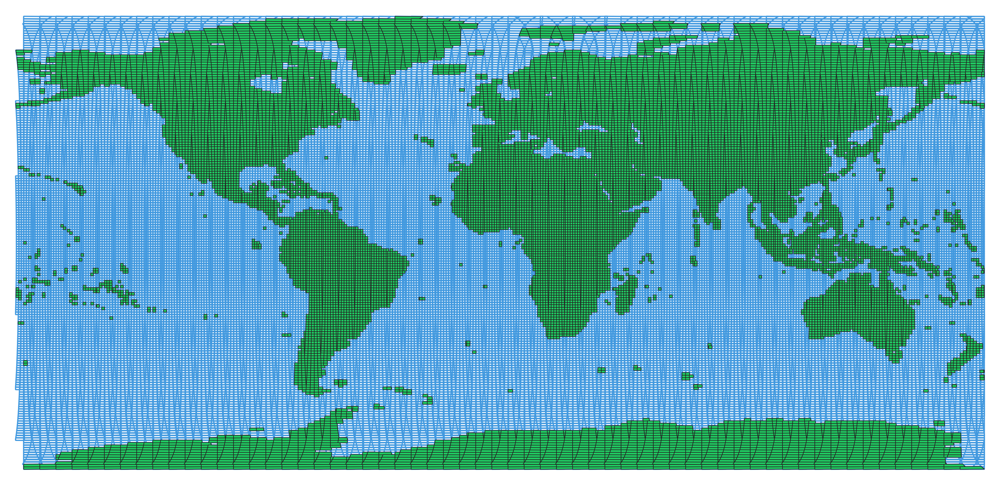

# Cloud-native geospatial Sentinel-2 grid

An update of [scottyhq/mgrs](https://github.com/scottyhq/mgrs) to convert the 
[Sentinel-2 grid](https://sentinels.copernicus.eu/web/sentinel/missions/sentinel-2/data-products) 
from KML to the cloud-native file format [GeoParquet](https://github.com/opengeospatial/geoparquet). 
Two versions are available in this repository:
- `sentinel-2-grid.parquet` - the full grid
- `sentinel-2-grid_LAND.parquet` - only tiles that intersect with land areas based on the high resolution land mask by [Natural Earth]("https://github.com/nvkelso/natural-earth-vector/blob/v5.1.2/geojson/ne_10m_land.geojson")

